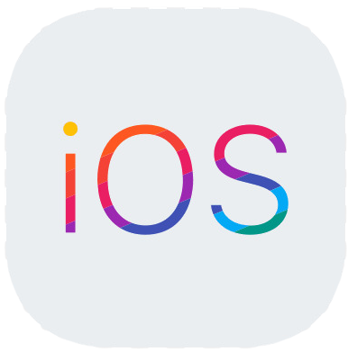
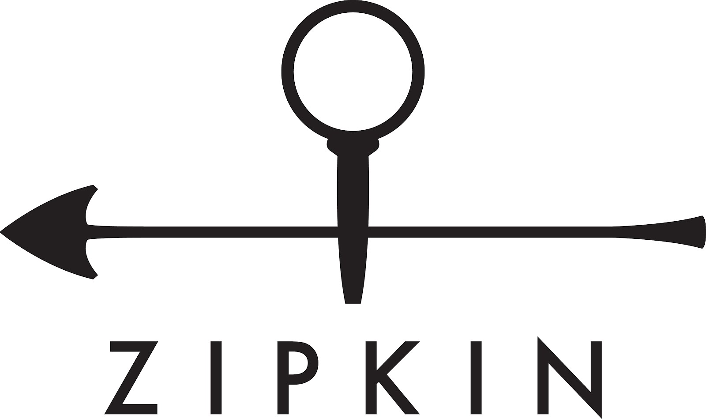

# S09P31C108
# 👩‍🏫everySCHOOL

  
교사, 학생, 학부모가 함께 만들어가는 플랫폼

   

---

# 🎬UCC

※ 이미지 클릭시 UCC youtube 이동 

# 🎃서비스 소개

# 👶프로젝트 소개

- 진행 기간 : 2023.10.09 ~ 2023.11.17

### 📂 저장소

- **[🔎 Front-end 저장소 (app)](./app)**
- **[🔎 Front-end 저장소 (web)](./web)**
- **[🔎 Back-end 저장소(회원 서버스)](./server/user-service/)**
- **[🔎 Back-end 저장소(학교 서비스)](./server/school-service/)**
- **[🔎 Back-end 저장소(채팅 서비스)](./server/chat-service/)**
- **[🔎 Back-end 저장소(채팅 분석 서비스)](./server/openai-service/)**
- **[🔎 Back-end 저장소(통화 서비스)](./server/call-service/)**
- **[🔎 Back-end 저장소(통화 분석 서비스)](./server/voiceai-service/)**
- **[🔎 Back-end 저장소(게시판 서비스)](./server/board-service/)**
- **[🔎 Back-end 저장소(신고 서비스)](./server/report-service/)**
- **[🔎 Back-end 저장소(알림 서비스)](./server/alarm-service/)**

## 👨‍🏫 주요 기능

| 기능        | 내용                                                                                                           |
|-----------|--------------------------------------------------------------------------------------------------------------|
|  |  |
|  |  |
|  |  |
|  |  |
|  |  |

## 👩‍🏫 기술 스택

### Front-end

|  |  |  |  |  |  |
|:------------:|:----------------:|:----------------:|:-----------------:|:---------------:|:--------------:|
| android | ios | kotlin | Kotlin Multiplatform | Mobile | swift | Thymeleaf |

### Back-end

|  |  |  |  |  |  |
|:-------:|:-------:|:-------:|:-------:|:-------:|:-------:|
| java17 | spring boot | spring cloud | netflix Eureka | MySQL | H2 | 

|  |  |  |  |  |  |
|:-----:|:-----:|:-----:|:-----:|:-----:|:------:|
| redis | python | FastAPI | mongoDB | SKT-AI : KoBART | OpenAI |

### DevOps & Tools & logging

|  |  |  |  |  |  |  |  |
|:-------:|:---------:|:---------:|:---------:|:---------:|:---------:|:---------:|:---------:|
| jenkins | docker | AWS EC2 | gradle | Jira | Slack | zipkin | rabbitMQ | 

---

### 아키텍쳐

### ERD

### MockUp

※ 이미지 클릭시 Figma 이동

---

# 😺 에브리스쿨 주요 기능

##  Main

## 👨‍👩‍👧‍👦팀 소개

<table align="center">
    <tr align="center">
        <td style="min-width: 150px;">
            <a href="https://github.com/chaos0103">
              
               
              <b>chaos0103</b>
            </a>
        </td>
        <td style="min-width: 150px;">
            <a href="https://github.com/leeyr0412">
              
               
              <b>leeyr0412</b>
            </a> 
        </td>
        <td style="min-width: 150px;">
            <a href="https://github.com/hans0537">
              
               
              <b>hans0537</b>
            </a> 
        </td>
        <td style="min-width: 150px;">
            <a href="https://github.com/OH-Yeonju">
              
               
              <b>OH-Yeonju</b>
            </a> 
        </td>
        <td style="min-width: 150px;">
            <a href="https://github.com/illu1996">
              
               
              <b>illu1996</b>
            </a> 
        </td>
        <td style="min-width: 150px;">
            <a href="https://github.com/hkh0904">
              
               
              <b>hkh0904</b>
            </a> 
        </td>
    </tr>
    <tr align="center">
        <td>
            임우택 (팀장) BE
        </td>
        <td>
            이예리 BE
        </td>
        <td>
            신성주 BE
        </td>
        <td>
            오연주 FE
        </td>
        <td>
            이지혁 FE
        </td>
        <td>
            홍경환 FE
        </td>
    </tr>
</table>

## 노션 활용

※ 이미지 클릭시 Notion 이동 
