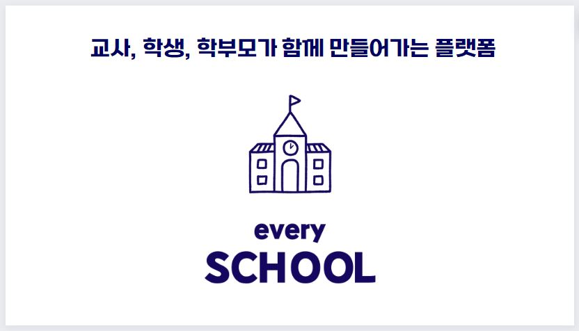
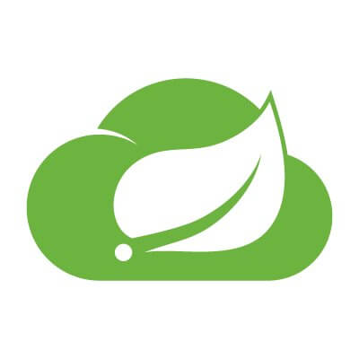
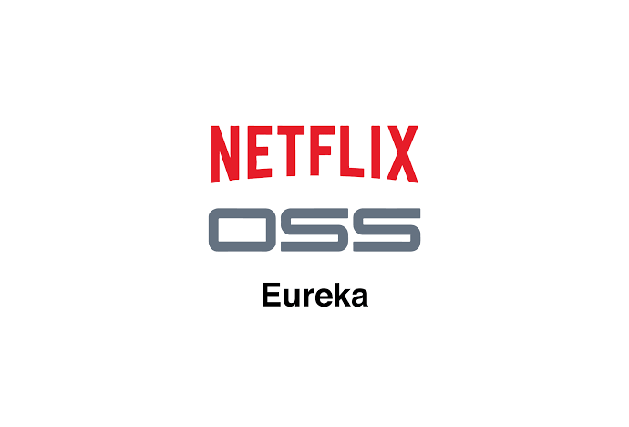
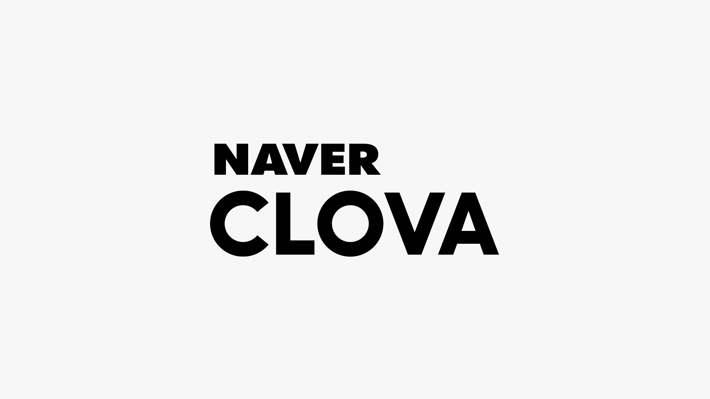
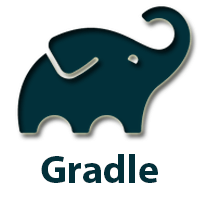
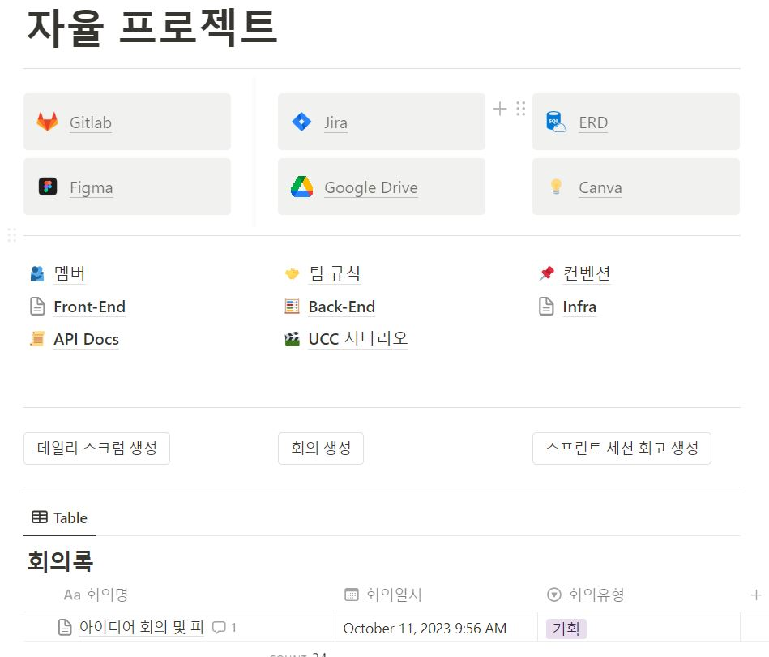
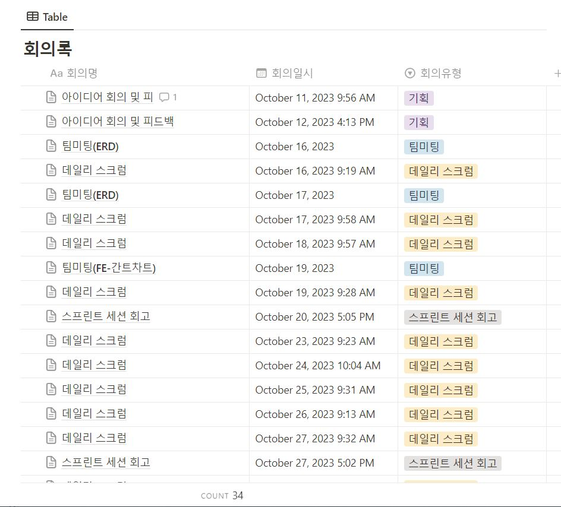

# 👩‍🏫everySCHOOL

  
교사, 학생, 학부모가 함께 만들어가는 플랫폼

   

---

# 🎬UCC

※ 이미지 클릭시 UCC youtube 이동

# 🎃서비스 소개

### 기획배경

악성민원으로 인한 안타까운 사건 사고를 방지하고 모니터링하여 교사의 사생활을 보호할 수 있으며,
교사와 학부모, 학생까지 안심하고 사용할 수 있는 **교내 소통 통합 어플리케이션**

### 👨‍🏫 주요 기능

| 기능     | 내용                                                                                   |
|--------|--------------------------------------------------------------------------------------|
| 채팅     | 악성 채팅 사전차단으로 서로 상처받지 않는 소통   채팅 내용을 분석하여 악성 대화를 기록하고 조회                          |
| 통화     | 교사나 학생, 학부모의 연락처를 서로 알지 못해도 어플을 통해 간편하게 통화 모든 통화는 기록되고 AI를 통해 통화 내용의 감정을 분석하여 기록 |
| 신고     | 교내 학교폭력, 학칙 위반, 악성 민원을 신고하고 관리                                                       |
| 상담신청   | 교사와의 상담 일정을 간편하게 잡기                                                                  |
| 방해금지   | 교사는 근무시간 외 시간을 연락을 받지 않는 방해금지 모드로 설정 가능                                              |
| 다양한게시판 | 학급 자유게시판, 교내 공지사항, 가정통신문 등                                                           |
| 업무시스템  | 웹사이트로 간편하게 관리할 수 있는 교사용 업무 시스템                                                       |

# 👶프로젝트 소개

- 진행 기간 : 2023.10.09 ~ 2023.11.17

### 📂 저장소

- **[🔎 Front-end 저장소 (app)](./app)**
- **[🔎 Front-end 저장소 (web)](./web)**
- **[🔎 Back-end 저장소(회원 서버스)](./server/user-service/)**
- **[🔎 Back-end 저장소(학교 서비스)](./server/school-service/)**
- **[🔎 Back-end 저장소(채팅 서비스)](./server/chat-service/)**
- **[🔎 Back-end 저장소(채팅 분석 서비스)](./server/openai-service/)**
- **[🔎 Back-end 저장소(통화 서비스)](./server/call-service/)**
- **[🔎 Back-end 저장소(통화 분석 서비스)](./server/voiceai-service/)**
- **[🔎 Back-end 저장소(게시판 서비스)](./server/board-service/)**
- **[🔎 Back-end 저장소(신고 서비스)](./server/report-service/)**
- **[🔎 Back-end 저장소(알림 서비스)](./server/alarm-service/)**

## 👩‍🏫 기술 스택

### Front-end

|  |  |  |  |  |
|:----------------------------------------------------------------------------------------------------------------------------------------------------------------------------------------------------------------------------------------:|:---------------------------------------------------------------------------------------------------------------------------------------------------------------------------------------------------------------------------------------:|:---------------------------------------------------------------------------------------:|:-----------------------------------------------------------------------------------------------------------------------------------:|:-----------------------------------------------------------------------------------:|
|                                                                                                                 flutter                                                                                                                  |                                                                                                                  React                                                                                                                  |                                        agora.io                                         |                                                              WebSocket                                                              |                                         fcm                                         | swift |

### Back-end

|  |  |  |  |
|:-------------------------------------------------------------------------------------:|:---------------------------------------------------------:|:----------------------------------------------------------------------------------------------:|:-----------------------------------------------------------------------------------------:|
|                                        java11                                         |                        spring boot                        |                                          spring cloud                                          |                                      netflix Eureka                                       | 

|  |  |  |  |
|:------------------------------------------------------------------------------------------:|:--------------------------------------------------------------------------------------------:|:----------------------------------------------------------------------------------------:|:-------------------------------------------------------------------------------------------:|
|                                           python                                           |                                           FastAPI                                            |                                          Clova                                           |                                           OpenAI                                            |

### Database

|  |  |  |  |  |  |
|:----------------------------------------------------------------------------------------:|:---------------------------------------------------------------------------------------:|:----------------------------------------------------------------------------------------:|:--------------------------------------------------------------------------------------------:|:----------------------------------------------------------------------------------------:|:---------------------------------------------------------------------------------------:|
|                                          MySQL                                           |                                           H2                                            |                                          redis                                           |                                           mongoDB                                            |                                          MySQL                                           |                                           S3                                            | 

### DevOps & Tools & logging

|  |  |  |  |  |  |  |  |
|:--------------:|:------------:|:------:|:------------:|:--------:|:----------:|:------------:|:------------:|
| jenkins | Ngnix | docker | AWS EC2 | gradle | Jira | Slack | rabbitMQ | 

---

### 아키텍쳐

### ERD

### MockUp

※ 이미지 클릭시 Figma 이동

---

# 😺 에브리스쿨 주요 기능

## Main

## 👨‍👩‍👧‍👦팀 소개

<table align="center">
    <tr align="center">
        <td style="min-width: 150;">
            <a href="https://github.com/chaos0103">
              
               
              <b>chaos0103</b>
            </a>
        </td>
        <td style="min-width: 150;">
            <a href="https://github.com/leeyr0412">
              
               
              <b>leeyr0412</b>
            </a> 
        </td>
        <td style="min-width: 150;">
            <a href="https://github.com/hans0537">
              
               
              <b>hans0537</b>
            </a> 
        </td>
        <td style="min-width: 150;">
            <a href="https://github.com/OH-Yeonju">
              
               
              <b>OH-Yeonju</b>
            </a> 
        </td>
        <td style="min-width: 150;">
            <a href="https://github.com/illu1996">
              
               
              <b>illu1996</b>
            </a> 
        </td>
        <td style="min-width: 150;">
            <a href="https://github.com/hkh0904">
              
               
              <b>hkh0904</b>
            </a> 
        </td>
    </tr>
    <tr align="center">
        <td>
            임우택 (팀장) BE
        </td>
        <td>
            이예리 BE
        </td>
        <td>
            신성주 BE
        </td>
        <td>
            오연주 FE
        </td>
        <td>
            이지혁 FE
        </td>
        <td>
            홍경환 FE
        </td>
    </tr>
</table>

## 노션 활용
 

※ 이미지 클릭시 Notion 이동 
